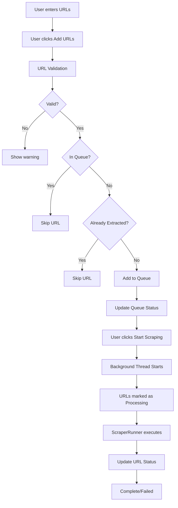
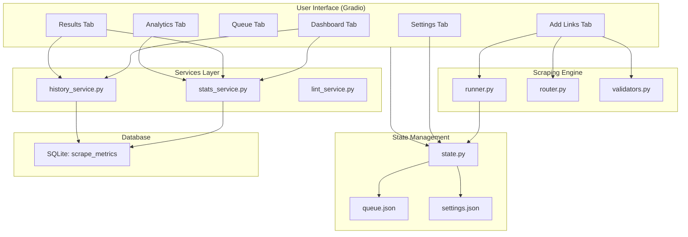
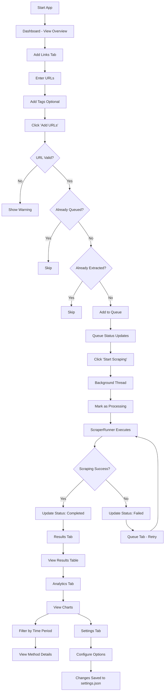

# KnowledgeAgent v2 - UI Documentation

## Overview

KnowledgeAgent v2 features a modern web-based user interface built with **Gradio 6.x** for the frontend and **Plotly** for interactive data visualizations. The UI provides a complete workflow for web scraping, from adding URLs to viewing results and analyzing performance.

### Technology Stack
| Technology | Purpose |
|------------|---------|
| Gradio 6.x | Web UI framework |
| Plotly | Interactive charts (radar, bar, pie, line) |
| HTML/CSS | Custom styling with CSS variables |
| Python | Backend logic and state management |

---

## File Structure

```
app/
├── main.py                    # App entry point, theme, CSS, tab routing
├── config.py                  # Centralized config loader (settings.json)
├── state.py                   # State management (queue, settings)
├── ui/
│   ├── __init__.py
│   ├── components/
│   │   ├── __init__.py
│   │   ├── charts.py          # Chart rendering functions
│   │   ├── header.py          # Header component
│   │   └── metric_card.py     # Metric card component
│   └── pages/
│       ├── __init__.py
│       ├── dashboard.py       # Dashboard tab
│       ├── add_links.py      # Add URLs tab
│       ├── queue.py          # Queue management tab
│       ├── results.py        # Results tab
│       ├── analytics.py      # Analytics tab
│       ├── scheduler.py      # Scheduler management tab (NEW)
│       ├── notifications.py  # Notification settings tab (NEW)
│       └── settings.py       # Settings tab
```

---

## Visual Design System

### Centralized Theme System

The UI uses a centralized theme system in `app/theme.py` that provides consistent colors for both light and dark themes.

#### Theme Module (`app/theme.py`)

The theme module is the single source of truth for all colors. It provides:

Both light and dark themes are defined in `app/theme.py`. The theme module provides helper functions and CSS variable generation.

#### Theme Module (`app/theme.py`)

```python
from app.theme import get_theme_colors, get_status_colors, get_type_colors
from app.theme import card_style, text_style, badge_html, stat_card

# Get all theme colors
colors = get_theme_colors()
# Returns: { 'bg_primary': '#ffffff', 'text_primary': '#111827', ... }

# Get status-specific colors
status = get_status_colors('completed')
# Returns: { 'bg': '#dcfce7', 'text': '#16a34a' }

# Get type-specific colors  
type_info = get_type_colors('novel')
# Returns: { 'bg': '#fce7f3', 'text': '#be185d' }

# Quick style helpers
card_html = card_style(theme=None, padding="16px")
text_html = text_style(theme=None, secondary=False)
badge = badge_html("Completed", "completed")
stat = stat_card(42, "Total Links")
```

#### Light Theme CSS Variables
```css
:root {
    --bg_primary: #ffffff;
    --bg_secondary: #f9fafb;
    --bg_tertiary: #f3f4f6;
    --bg_card: #ffffff;
    --bg_input: #ffffff;
    --text_primary: #111827;
    --text_secondary: #6b7280;
    --text_muted: #9ca3af;
    --border: #e5e7eb;
    --border_focus: #3b82f6;
    --primary: #3b82f6;
    --primary_hover: #2563eb;
    --success: #16a34a;
    --success_bg: #dcfce7;
    --warning: #d97706;
    --warning_bg: #fef3c7;
    --danger: #dc2626;
    --danger_bg: #fee2e2;
    --info: #1d4ed8;
    --info_bg: #dbeafe;
}
```

#### Dark Theme CSS Variables
```css
[data-theme="dark"] {
    --bg_primary: #111827;
    --bg_secondary: #1f2937;
    --bg_tertiary: #374151;
    --bg_card: #1f2937;
    --bg_input: #374151;
    --text_primary: #f9fafb;
    --text_secondary: #9ca3af;
    --text_muted: #6b7280;
    --border: #374151;
    --border_focus: #60a5fa;
    --primary: #3b82f6;
    --primary_hover: #60a5fa;
    --success: #22c55e;
    --success_bg: #14532d;
    --warning: #f59e0b;
    --warning_bg: #78350f;
    --danger: #ef4444;
    --danger_bg: #7f1d1d;
    --info: #3b82f6;
    --info_bg: #1e3a8a;
}
```

### Status Badges (Theme-Aware)

| Status | Light BG | Light Text | Dark BG | Dark Text |
|--------|----------|------------|---------|-----------|
| Pending | #dbeafe | #1d4ed8 | #1e3a8a | #60a5fa |
| Completed | #dcfce7 | #16a34a | #14532d | #22c55e |
| Failed | #fee2e2 | #dc2626 | #7f1d1d | #f87171 |
| Processing | #fef3c7 | #d97706 | #78350f | #fbbf24 |

### Type Badges

| Type | Light BG | Light Text | Dark BG | Dark Text |
|------|----------|------------|---------|-----------|
| Normal | #e0e7ff | #4338ca | #312e81 | #a5b4fc |
| Novel | #fce7f3 | #be185d | #831843 | #f9a8d4 |
| Heavy | #fef3c7 | #b45309 | #78350f | #fdba74 |
| Skip | #f3f4f6 | #6b7280 | #374151 | #9ca3af |

### Using Theme Colors in Page Code

All UI pages should import and use theme colors via the centralized theme module:

```python
from app.theme import get_theme_colors, get_status_colors, get_type_colors

def render_example() -> str:
    colors = get_theme_colors()
    status = get_status_colors('completed')
    type_info = get_type_colors('novel')
    
    return f"""
    <div style="background: {colors['bg_card']}; color: {colors['text_primary']}; 
                border: 1px solid {colors['border']}; padding: 16px; border-radius: 8px;">
        <span style="background: {status['bg']}; color: {status['text']}; 
                     padding: 4px 10px; border-radius: 12px;">Completed</span>
        <span style="background: {type_info['bg']}; color: {type_info['text']}; 
                     padding: 2px 8px; border-radius: 4px;">Novel</span>
    </div>
    """
```

### Helper Functions

The theme module provides convenience functions for common styling patterns:

| Function | Purpose |
|----------|---------|
| `get_theme_colors(theme)` | Get all colors for a theme |
| `get_status_colors(status, theme)` | Get colors for a status badge |
| `get_type_colors(type_name, theme)` | Get colors for a type badge |
| `card_style(theme, **extra)` | Generate card CSS style string |
| `text_style(theme, secondary, **extra)` | Generate text CSS style string |
| `badge_html(text, status, theme)` | Generate HTML for status badge |
| `type_badge_html(text, type_name, theme)` | Generate HTML for type badge |
| `stat_card(value, label, color, theme)` | Generate HTML for stat card |
| `table_row_style(theme, alternate)` | Get alternating row background |
| `input_style(theme, **extra)` | Generate input field CSS style |
| `generate_css_variables(theme)` | Generate CSS custom properties |
| `generate_all_css()` | Generate CSS for all themes |

---

## Page-by-Page Documentation

### 1. Dashboard Tab (`dashboard.py`)

#### Purpose
Provides an overview of scraping activities with quick statistics and recent activity feed.

#### Visual Layout

```
┌─────────────────────────────────────────────────────────────┐
│  📈 Dashboard                                              │
│  Overview of your knowledge extraction                     │
├─────────────────────────────────────────────────────────────┤
│  [🔄 Refresh]                                               │
├─────────────────────────────────────────────────────────────┤
│  ┌───────────────────────────────┐  ┌────────────────────┐ │
│  │  📊 Extraction Stats         │  │ ⚡ Quick Stats     │ │
│  │  ┌─────┐ ┌─────┐            │  │ ┌──────────────┐  │ │
│  │  │ 156 │ │ 23  │  (gauges)  │  │ │ Pending: 5   │  │ │
│  │  │Links │ │Novels│            │  │ │ Total: 156   │  │ │
│  │  └─────┘ └─────┘            │  │ │ Novels: 23   │  │ │
│  │  ┌─────┐ ┌─────┐            │  │ │ Words: 45K   │  │ │
│  │  │ 892 │ │45K  │            │  │ └──────────────┘  │ │
│  │  │Chaps│ │Words │            │  │                    │ │
│  │  └─────┘ └─────┘            │  └────────────────────┘ │
│  └───────────────────────────────┘                         │
├─────────────────────────────────────────────────────────────┤
│  🎯 Method Efficiency (Radar)                               │
│  [=========== Radar Chart ===========]                      │
│  Shows method comparison: Success Rate, Speed, Efficiency  │
├─────────────────────────────────────────────────────────────┤
│  📝 Recent Activity                                         │
│  ┌──────────────────────────────────────────────────────┐  │
│  │ Status │ Method      │ Time   │ Domain               │  │
│  ├────────┼─────────────┼────────┼──────────────────────┤  │
│  │ ✅     │ playwright  │ 2450ms │ wikipedia.org        │  │
│  │ ❌     │ simple_http │ 890ms  │ blocked-site.com    │  │
│  │ ✅     │ cloudscraper│ 3200ms │ medium.com          │  │
│  └──────────────────────────────────────────────────────┘  │
└─────────────────────────────────────────────────────────────┘
```

#### Components

| Component | Type | Description |
|-----------|------|-------------|
| Refresh Button | `gr.Button` | Triggers dashboard data refresh |
| Stats Plot | `gr.Plot` (Plotly) | 4 gauge indicators showing totals |
| Quick Stats | `gr.HTML` | Colored cards with pending/total/novels/words |
| Radar Plot | `gr.Plot` (Plotly) | Method efficiency comparison |
| Recent Activity | `gr.HTML` | Table with last 10 scrape attempts |

#### Data Sources

```python
# Services used
from app.services.history_service import history_service
from app.services.stats_service import stats_service

# Functions called
history_service.get_stats()           # → total_links, novels, chapters, words
stats_service.get_method_stats(None)   # → method performance data
stats_service.get_recent(10)          # → last 10 scrape attempts
```

#### Key Functions

| Function | Purpose |
|----------|---------|
| `create_dashboard_tab()` | Creates the dashboard tab layout |
| `update_dashboard()` | Callback for refresh button - gathers all data |
| `_render_quick_stats()` | Generates HTML for quick stats cards |
| `_render_stats_gauge()` | Creates Plotly gauge figure |
| `_render_recent_activity()` | Generates HTML table of recent activity |

---

### 2. Add Links Tab (`add_links.py`)

#### Purpose
Input area for adding URLs to the scraping queue and initiating the scraping process.

#### Visual Layout

```
┌─────────────────────────────────────────────────────────────┐
│  ➕ Add URLs                                               │
├─────────────────────────────────────────────────────────────┤
│  ┌─────────────────────────────────────┐ ┌──────────────┐  │
│  │  Normal Links                       │ │ 🚀 Start     │  │
│  │                                     │ │ Scraping     │  │
│  │  ┌─────────────────────────────┐    │ │              │  │
│  │  │ Paste URLs (one per line)  │    │ │[🚀 Start     │  │
│  │  │ https://en.wikipedia.org/.. │    │ │ Scraping Now]│  │
│  │  │ https://medium.com/...      │    │ │              │  │
│  │  │                             │    │ │ ──────────── │  │
│  │  └─────────────────────────────┘    │ │ 📋 Queue     │  │
│  │                                     │ │ Status       │  │
│  │  Tags (comma separated)             │ │ ┌──────────┐ │  │
│  │  ┌─────────────────────────────┐    │ │ │Pending:3 │ │  │
│  │  │ AI, technology, science     │    │ │ │Done: 12  │ │  │
│  │  └─────────────────────────────┘    │ │ │Failed:1  │ │  │
│  │                                     │ │ │Novels:2  │ │  │
│  │  [➕ Add URLs] [🗑️ Clear]          │ │ └──────────┘ │  │
│  │                                     │ │ ──────────── │  │
│  │                                     │ │ 📊 Statistics│ │
│  │                                     │ │ Extracted: 45│ │
│  │                                     │ │ Novels: 3    │ │
│  │                                     │ │ Chapters: 89 │ │
│  │                                     │ │ Words: 12K   │ │
│  └─────────────────────────────────────┘ └──────────────┘  │
└─────────────────────────────────────────────────────────────┘
```

#### Components

| Component | Type | Description |
|-----------|------|-------------|
| URLs Input | `gr.Textbox` | Multi-line text area for URL input |
| Tags Input | `gr.Textbox` | Comma-separated tags for categorization |
| Add Button | `gr.Button` | Adds URLs to queue |
| Clear Button | `gr.Button` | Clears the input field |
| Start Scraping Button | `gr.Button` | Initiates background scraping |
| Queue Status | `gr.HTML` | Live queue statistics |
| Statistics | `gr.HTML` | Historical extraction stats |

#### User Flow



#### Data Flow

```python
# State management
from app.state import state

# Functions
state.url_in_queue(url)           # Check if URL already in queue
state.add_url(url, "normal", tags) # Add URL to queue
state.update_url_status(url, "processing")
state.update_url_status(url, "completed" | "failed")

# Validation
from utils.validators import is_valid_url, parse_tags

# Routing
from scraper.router import route_url  # Determines URL type
```

#### Key Functions

| Function | Purpose |
|----------|---------|
| `create_add_links_tab()` | Creates the add links tab layout |
| `create_normal_input()` | Creates URL input form |
| `create_sidebar()` | Creates queue status and stats sidebar |
| `add_normal_urls(urls_text, tags)` | Validates and adds URLs to queue |
| `start_scrape()` | Initiates background scraping thread |

---

### 3. Queue Tab (`queue.py`)

#### Purpose
Displays all URLs in various queue states and provides access to retry failed items.

#### Visual Layout

```
┌─────────────────────────────────────────────────────────────┐
│  📋 Queue Management                                        │
│  [🔄 Refresh Queue]                                         │
├─────────────────────────────────────────────────────────────┤
│  [Pending URLs] [Pending Novels] [Retry Normal] [Retry Novel] │
├─────────────────────────────────────────────────────────────┤
│  Tab: Pending URLs                                         │
│  ┌────────────────────────────────────────────────────────┐  │
│  │ Pending: 3    Completed: 12    Failed: 1              │  │
│  ├────────────────────────────────────────────────────────┤  │
│  │ URL                    │ Type   │ Tags    │ Action    │  │
│  ├────────────────────────┼────────┼─────────┼───────────┤  │
│  │ wikipedia.org/wiki/X  │ normal │ AI, tech│ -         │  │
│  │ medium.com/article    │ normal │ news    │ -         │  │
│  └────────────────────────────────────────────────────────┘  │
├─────────────────────────────────────────────────────────────┤
│  Tab: Pending Novels                                        │
│  ┌────────────────────────────────────────────────────────┐  │
│  │ URL                    │ Chapters                    │  │
│  ├────────────────────────┼─────────────────────────────┤  │
│  │ novel-site.com/book1   │ Ch 1-50                     │  │
│  └────────────────────────────────────────────────────────┘  │
├─────────────────────────────────────────────────────────────┤
│  Tab: Retry Normal (Failed URLs)                             │
│  ┌────────────────────────────────────────────────────────┐  │
│  │ URL                    │ Error                        │  │
│  ├────────────────────────┼─────────────────────────────┤  │
│  │ blocked.com/page       │ 403 Forbidden              │  │
│  └────────────────────────────────────────────────────────┘  │
└─────────────────────────────────────────────────────────────┘
```

#### Components

| Component | Type | Description |
|-----------|------|-------------|
| Refresh Button | `gr.Button` | Refreshes all queue tabs |
| Pending URLs Tab | `gr.Tab` | Shows pending/normal URLs |
| Pending Novels Tab | `gr.Tab` | Shows pending novel URLs |
| Retry Normal Tab | `gr.Tab` | Failed normal URLs |
| Retry Novel Tab | `gr.Tab` | Failed novel chapters |

#### Data Sources

```python
# State access
from app.state import state

# Queue data structure
state.queue = {
    "urls": [
        {"url": "...", "type": "normal", "tags": [...], "status": "pending|completed|failed|processing", "error": "..."}
    ],
    "novels": [
        {"url": "...", "start_chapter": 1, "end_chapter": 50, "status": "pending"}
    ],
    "retry_normal": [...],
    "retry_novel": [...]
}
```

#### Key Functions

| Function | Purpose |
|----------|---------|
| `create_queue_tab()` | Creates queue tab with all sub-tabs |
| `render_pending_urls_html()` | Generates HTML for pending URLs table |
| `render_pending_novels_html()` | Generates HTML for pending novels |
| `render_retry_normal_html()` | Generates HTML for failed normal URLs |
| `render_retry_novel_html()` | Generates HTML for failed novel chapters |

---

### 4. Results Tab (`results.py`)

#### Purpose
Displays the results of completed scraping operations in a tabular format.

#### Visual Layout

```
┌─────────────────────────────────────────────────────────────┐
│  📄 Scraped Results                                        │
│  [🔄 Refresh]                                               │
├─────────────────────────────────────────────────────────────┤
│  ┌─────────┐ ┌─────────┐ ┌─────────┐ ┌──────────┐          │
│  │   156   │ │   23    │ │   892   │ │  45,234  │          │
│  │Normal   │ │ Novels  │ │Chapters │ │  Words   │          │
│  │  Links  │ │         │ │         │ │          │          │
│  └─────────┘ └─────────┘ └─────────┘ └──────────┘          │
├─────────────────────────────────────────────────────────────┤
│  Recently Scraped URLs                                      │
│  ┌────────────────────────────────────────────────────────┐  │
│  │Status│Domain      │URL                │Words │Time │Method│  │
│  ├──────┼────────────┼──────────────────┼──────┼─────┼──────┤  │
│  │  ✅  │wikipedia   │en.wikipedia.org/ │2,450 │890ms│Play- │  │
│  │      │            │wiki/Mars...       │      │     │wright│  │
│  ├──────┼────────────┼──────────────────┼──────┼─────┼──────┤  │
│  │  ❌  │blocked.com │blocked.net/pa... │  0   │120ms│simple│  │
│  └──────┴────────────┴──────────────────┴──────┴─────┴──────┘  │
└─────────────────────────────────────────────────────────────┘
```

#### Components

| Component | Type | Description |
|-----------|------|-------------|
| Refresh Button | `gr.Button` | Refreshes results table |
| Stats Cards | `gr.HTML` | 4 cards showing totals |
| Results Table | `gr.HTML` | Detailed table of scraped URLs |

#### Data Sources

```python
# Services
from app.services.stats_service import stats_service
from app.services.history_service import history_service

# Functions
stats_service.get_recent(50)    # Last 50 scrape attempts
history_service.get_stats()     # Historical totals
```

#### Key Functions

| Function | Purpose |
|----------|---------|
| `create_results_tab()` | Creates results tab layout |
| `render_results()` | Generates HTML for stats cards and results table |

---

### 5. Analytics Tab (`analytics.py`)

#### Purpose
Provides detailed performance analytics with interactive charts and time period filtering.

#### Visual Layout

```
┌─────────────────────────────────────────────────────────────┐
│  📊 Analytics                                              │
│  Scraping method performance and trends                    │
├─────────────────────────────────────────────────────────────┤
│  Time Period: [All Time ▼]  [🔄 Refresh]                   │
├─────────────────────────────────────────────────────────────┤
│  ┌───────────────────┐ ┌────────────────────────────────┐   │
│  │ Overview          │ │ Method Performance              │   │
│  │                   │ │                                │   │
│  │    ┌───────┐      │ │     ┌──────────────────┐      │   │
│  │    │ 78.5% │      │ │    ╱                   ╲     │   │
│  │    │Success│      │ │   ╱     Radar Chart    ╲    │   │
│  │    └───────┘      │ │  ╱       comparing       ╲   │   │
│  │  Success vs Failed│ │ ╱  all methods on 5 axes   ╲  │   │
│  │                   │ │────────────────────────────── │   │
│  └───────────────────┘ └────────────────────────────────┘   │
├─────────────────────────────────────────────────────────────┤
│  ┌───────────────────┐ ┌────────────────────────────────┐   │
│  │ Success vs Failed │ │ Success/Fail by Method          │   │
│  │                   │ │                                │   │
│  │    (pie chart)    │ │    [███ Success] [██ Failed]  │   │
│  │                   │ │    Simple HTTP:  45  |  12    │   │
│  │                   │ │    Playwright:    89  |   5   │   │
│  │                   │ │    CloudScraper:  34  |   8   │   │
│  └───────────────────┘ └────────────────────────────────┘   │
├─────────────────────────────────────────────────────────────┤
│  ┌───────────────────┐ ┌────────────────────────────────┐   │
│  │ Efficiency Scores│ │ Daily Activity                  │   │
│  │                   │ │                                │   │
│  │  Playwright  95  │ │      ___/                      │   │
│  │  CloudScraper 78 │ │   __/          ___/           │   │
│  │  Simple HTTP 65  │ │  _/     ___----     ___--      │   │
│  │                   │ │      Daily Success/Fail       │   │
│  └───────────────────┘ └────────────────────────────────┘   │
├─────────────────────────────────────────────────────────────┤
│  📋 Method Details                                          │
│  ┌──────────────────────────────────────────────────────────┐ │
│  │ Method     │Attempts│Success│Failed│Success │Avg Time│  │
│  │            │        │       │      │Rate    │        │  │
│  │ Playwright│   94   │  89   │  5   │ 94.7%  │ 2400ms │  │
│  │ Simple HTTP│   57   │  45   │  12  │ 78.9%  │  890ms │  │
│  └──────────────────────────────────────────────────────────┘ │
└─────────────────────────────────────────────────────────────┘
```

#### Time Periods Available
- All Time
- Last 7 days
- Last 15 days
- Last 30 days
- Last 90 days

#### Components

| Component | Type | Description |
|-----------|------|-------------|
| Period Dropdown | `gr.Dropdown` | Time period filter |
| Refresh Button | `gr.Button` | Refresh all charts |
| Overview Plot | `gr.Plot` (Pie) | Success vs failed donut |
| Radar Plot | `gr.Plot` | Method efficiency comparison |
| Pie Plot | `gr.Plot` | Duplicate success/failed |
| Bar Plot | `gr.Plot` | Grouped bar success/fail by method |
| Efficiency Plot | `gr.Plot` | Horizontal bar efficiency scores |
| Line Plot | `gr.Plot` | Daily activity trends |
| Method Details | `gr.HTML` | Detailed statistics table |

#### Data Sources

```python
from app.services.stats_service import stats_service

# Functions
stats_service.get_method_stats(days)     # Method performance data
stats_service.get_summary_stats(days)    # Overall summary
stats_service.get_daily_activity(days)    # Daily breakdown
```

#### Chart Types (in `charts.py`)

| Chart | Function | Purpose |
|-------|----------|---------|
| Radar | `render_radar_chart()` | Multi-axis method comparison |
| Bar (Grouped) | `render_method_bar_chart()` | Success/fail per method |
| Pie/Donut | `render_success_pie()` | Overall success rate |
| Line | `render_daily_line_chart()` | 14-day activity trend |
| Bar (Horizontal) | `render_efficiency_bar()` | Efficiency score ranking |

#### Key Functions

| Function | Purpose |
|----------|---------|
| `create_analytics_tab()` | Creates analytics tab layout |
| `update_charts(period_name)` | Callback for refresh/period change |
| `_render_method_details()` | Generates HTML method details table |

---

### 6. Settings Tab (`settings.py`)

#### Purpose
Provides configuration options for all aspects of the application.

#### Visual Layout

```
┌─────────────────────────────────────────────────────────────┐
│  ⚙️ Settings                                                │
├─────────────────────────────────────────────────────────────┤
│  ▼ Appearance                                               │
│    Theme: (●) Dark  ( ) Light                              │
├─────────────────────────────────────────────────────────────┤
│  ▼ Export Settings                                          │
│    Default Format: [md ▼]                                  │
├─────────────────────────────────────────────────────────────┤
│  ▼ Scraping Behavior                                        │
│    ☑ Respect robots.txt                                     │
│    Concurrent Jobs: ──────●──── 3                          │
│    Retry Failed: ────────●──── 2                           │
├─────────────────────────────────────────────────────────────┤
│  ▼ Novel Settings                                           │
│    Delay between chapters (to avoid IP blocking)          │
│    Min Delay: ( 90 )   Max Delay: ( 120 ) seconds          │
├─────────────────────────────────────────────────────────────┤
│  ▼ Data Management                                           │
│    ☑ Auto-save queue on close                               │
│    [Clear All Settings]                                     │
├─────────────────────────────────────────────────────────────┤
│  ▼ Notifications                                             │
│    ☑ Enable notifications                                   │
│    ☑ On success                                             │
│    ☑ On failure                                             │
├─────────────────────────────────────────────────────────────┤
│  ▼ Scheduler                                                 │
│    ☐ Enable scheduler                                       │
├─────────────────────────────────────────────────────────────┤
│  ▼ Method Optimization                                       │
│    ☑ Enable auto-optimization                               │
│    Min samples: ( 10 )   Successes to promote: ( 5 )       │
├─────────────────────────────────────────────────────────────┤
│  ▼ Markdown Linting                                          │
│    ☐ Auto-lint on startup                                   │
│    ☐ Auto-lint on scrape completion                         │
│    [Lint Output Folder]                                     │
├─────────────────────────────────────────────────────────────┤
│  Current Settings (JSON)                                   │
│  {                                                          │
│    "theme": "dark",                                        │
│    "respect_robots_txt": false,                            │
│    ...                                                     │
│  }                                                          │
└─────────────────────────────────────────────────────────────┘
```

#### Settings Categories

| Category | Settings |
|----------|----------|
| **Appearance** | theme (dark/light) |
| **Export** | export_format (md/txt/json), output_folder |
| **Scraping** | respect_robots_txt, concurrent_jobs, retry_count |
| **Novel** | novel_delay_min, novel_delay_max |
| **Data** | auto_save_queue |
| **Notifications** | notifications_enabled, notify_on_success, notify_on_failure |
| **Scheduler** | scheduler_enabled |
| **Method Optimization** | auto_optimize, optimization_threshold, success_promotion_threshold |
| **Markdown Linting** | auto_lint_startup, auto_lint_scrape |

#### Data Sources

```python
from app.state import state

# Functions
state.get_setting(key, default)    # Get setting value
state.set_setting(key, value)       # Set and save setting
state.settings                       # Direct settings dict access
```

#### Key Functions

| Function | Purpose |
|----------|---------|
| `create_settings_tab()` | Creates settings tab with all accordions |
| `reset_settings()` | Resets all settings to defaults |

---

### 7. Scheduler Tab (`scheduler.py`)

#### Purpose
Provides scheduled job management for automated scraping.

#### Visual Layout

```
┌─────────────────────────────────────────────────────────────┐
│  ⏰ Scheduler                                               │
│  Automated scraping schedules                              │
├─────────────────────────────────────────────────────────────┤
│  ┌─────────────────────────────────────────────────────────┐ │
│  │ 🟢 Scheduler Status: Running                            │ │
│  │                                                          │ │
│  │ [▶️ Start]  [⏹️ Stop]                                    │ │
│  └─────────────────────────────────────────────────────────┘ │
├─────────────────────────────────────────────────────────────┤
│  ▼ Add New Job                                              │
│    ┌────────────────────────┐ ┌───────────────────────────┐  │
│    │ Job Name: [___________] │ │ Schedule Type:           │  │
│    │                        │ │ (●) Interval  ( ) Cron   │  │
│    │ URL(s):                │ │                           │  │
│    │ [__________________]   │ │ [Every ___ ▼] minutes    │  │
│    │ (one per line)         │ │                           │  │
│    │                        │ │ [➕ Add Job]              │  │
│    └────────────────────────┘ └───────────────────────────┘  │
├─────────────────────────────────────────────────────────────┤
│  Active Jobs                                                │
│  ┌────────────────────────────────────────────────────────┐   │
│  │ Job Name    │ Schedule    │ Next Run    │ Actions     │   │
│  ├─────────────┼──────────────┼─────────────┼─────────────┤   │
│  │ Daily Wiki  │ Every 60 min │ 14:30       │ [🗑️] [▶️/⏸️] │   │
│  │ Weekly Tech │ Every 10080m │ Next Sunday │ [🗑️] [▶️/⏸️] │   │
│  └────────────────────────────────────────────────────────┘   │
└─────────────────────────────────────────────────────────────┘
```

#### Components

| Component | Type | Description |
|-----------|------|-------------|
| Status Display | `gr.HTML` | Shows running/stopped status |
| Start/Stop Buttons | `gr.Button` | Control scheduler |
| Job Name Input | `gr.Textbox` | Name for the scheduled job |
| Schedule Type | `gr.Radio` | Interval or cron-based |
| Interval Dropdown | `gr.Dropdown` | Minute/hour/day options |
| Add Job Button | `gr.Button` | Creates new scheduled job |
| Jobs Table | `gr.HTML` | List of active jobs with actions |

#### Data Sources

```python
from app.services.scheduler_service import scheduler_service

# Functions
scheduler_service.start()           # Start the scheduler
scheduler_service.stop()            # Stop the scheduler
scheduler_service.add_interval_job() # Add interval-based job
scheduler_service.add_cron_job()    # Add cron-based job
scheduler_service.remove_job()      # Remove a job
scheduler_service.get_jobs()        # List all jobs
```

---

### 8. Notifications Tab (`notifications.py`)

#### Purpose
Configure and test desktop notifications using plyer.

#### Visual Layout

```
┌─────────────────────────────────────────────────────────────┐
│  🔔 Notifications                                           │
│  Desktop notification settings                             │
├─────────────────────────────────────────────────────────────┤
│  ▼ Enable Notifications                                     │
│    ┌─────────────────────────────────────────────────────┐   │
│    │ ☑ Enable desktop notifications                      │   │
│    │                                                     │   │
│    │ Events to notify:                                  │   │
│    │ ☑ Scraping completed                               │   │
│    │ ☑ Scraping failed                                  │   │
│    │ ☑ Queue empty                                      │   │
│    │ ☑ Scheduler started/stopped                        │   │
│    └─────────────────────────────────────────────────────┘   │
├─────────────────────────────────────────────────────────────┤
│  ▼ Test Notifications                                        │
│    ┌─────────────────────────────────────────────────────┐   │
│    │ [🔔 Send Test Notification]                         │   │
│    │                                                     │   │
│    │ Status: Last sent at 14:30:22                      │   │
│    └─────────────────────────────────────────────────────┘   │
└─────────────────────────────────────────────────────────────┘
```

#### Components

| Component | Type | Description |
|-----------|------|-------------|
| Enable Toggle | `gr.Checkbox` | Master notification on/off |
| Event Checkboxes | `gr.Checkbox` | Per-event notification toggle |
| Test Button | `gr.Button` | Send test notification |
| Status Display | `gr.HTML` | Last notification timestamp |

#### Data Sources

```python
from app.services.notification_service import notification_service

# Functions
notification_service.enable()           # Enable notifications
notification_service.disable()          # Disable notifications
notification_service.send(title, msg)   # Send notification
notification_service.send_test()        # Send test notification
notification_service.is_enabled()       # Check if enabled
```

---

## Chart Components (`charts.py`)

### Method Color Scheme

```python
METHOD_COLORS = {
    "simple_http": "#3b82f6",     # Blue
    "playwright": "#8b5cf6",      # Purple
    "playwright_alt": "#06b6d4",  # Cyan
    "playwright_tls": "#f59e0b",  # Amber
    "cloudscraper": "#10b981",    # Emerald
}
```

### Radar Chart Dimensions

| Axis | Description | Calculation |
|------|-------------|-------------|
| Success Rate | % of successful scrapes | `success / total_attempts` |
| Speed | Performance score | `max(0, 100 - avg_time_ms / 50)` |
| Word Efficiency | Words per attempt | `min(avg_words / 50 * 100, 100)` |
| Usage | How often used | `min(attempts / 10 * 100, 100)` |
| Efficiency Score | Combined metric | `success_rate * 0.4 + speed * 0.3 + word_efficiency * 0.3` |

---

## Data Flow Architecture



---

## Service Connections

### Dashboard Tab Connections

```
┌─────────────────────────────────────────────────────────────────┐
│  DASHBOARD                                                     │
├─────────────────────────────────────────────────────────────────┤
│  Input:                                                        │
│    - (none - pull-based)                                      │
│                                                                 │
│  Data Sources:                                                │
│    ├─► history_service.get_stats()                             │
│    │     └─► SQLite: scrape_metrics                            │
│    │           → total_links, novels, chapters, words          │
│    │                                                             │
│    ├─► stats_service.get_method_stats(None)                    │
│    │     └─► SQLite: scrape_metrics                            │
│    │           → method performance (radar chart)              │
│    │                                                             │
│    └─► stats_service.get_recent(10)                             │
│          └─► SQLite: scrape_metrics                            │
│                → recent 10 scrape attempts                     │
└─────────────────────────────────────────────────────────────────┘
```

### Add Links Tab Connections

```
┌─────────────────────────────────────────────────────────────────┐
│  ADD LINKS                                                     │
├─────────────────────────────────────────────────────────────────┤
│  Input:                                                        │
│    - URL text (user input)                                     │
│    - Tags text (user input)                                    │
│                                                                 │
│  Data Flow:                                                    │
│    1. is_valid_url(url) → utils/validators.py                  │
│    2. route_url(url) → scraper/router.py                       │
│    3. state.url_in_queue(url) → state.py                       │
│    4. state.add_url(url, type, tags) → queue.json            │
│    5. Start Scraping → threading → runner.py                  │
│                                                                 │
│  Output:                                                       │
│    - queue.json updated                                        │
│    - scrape_metrics SQLite updated (after scraping)           │
└─────────────────────────────────────────────────────────────────┘
```

### Queue Tab Connections

```
┌─────────────────────────────────────────────────────────────────┐
│  QUEUE                                                         │
├─────────────────────────────────────────────────────────────────┤
│  Input:                                                        │
│    - (none - pull-based)                                      │
│                                                                 │
│  Data Sources:                                                │
│    └─► state.queue                                             │
│          ├─► urls[] (status: pending/completed/failed)         │
│          ├─► novels[] (status: pending/completed)              │
│          ├─► retry_normal[]                                    │
│          └─► retry_novel[]                                     │
│                                                                 │
│  Output:                                                       │
│    - No direct output (read-only display)                      │
└─────────────────────────────────────────────────────────────────┘
```

### Results Tab Connections

```
┌─────────────────────────────────────────────────────────────────┐
│  RESULTS                                                       │
├─────────────────────────────────────────────────────────────────┤
│  Input:                                                        │
│    - (none - pull-based)                                      │
│                                                                 │
│  Data Sources:                                                │
│    ├─► stats_service.get_recent(50)                           │
│    │     └─► SQLite: scrape_metrics                            │
│    │           → url, domain, word_count, time_ms, method      │
│    │                                                             │
│    └─► history_service.get_stats()                            │
│          └─► SQLite: scrape_metrics                            │
│                → total_links, novels, chapters, words          │
└─────────────────────────────────────────────────────────────────┘
```

### Analytics Tab Connections

```
┌─────────────────────────────────────────────────────────────────┐
│  ANALYTICS                                                     │
├─────────────────────────────────────────────────────────────────┤
│  Input:                                                        │
│    - Time Period (dropdown)                                    │
│                                                                 │
│  Data Sources:                                                │
│    ├─► stats_service.get_method_stats(days)                   │
│    │     └─► SQLite: scrape_metrics                            │
│    │           → per-method: attempts, success, failed,        │
│    │               avg_time_ms, total_words, efficiency        │
│    │                                                             │
│    ├─► stats_service.get_summary_stats(days)                   │
│    │     └─► SQLite: scrape_metrics                            │
│    │           → total_success, total_failed, success_rate    │
│    │                                                             │
│    └─► stats_service.get_daily_activity(days)                 │
│          └─► SQLite: scrape_metrics                            │
│                → date → {success, failed, urls}               │
│                                                                 │
│  Charts Generated:                                            │
│    ├─► render_success_pie(summary) → Pie/Donut               │
│    ├─► render_radar_chart(method_stats) → Radar               │
│    ├─► render_method_bar_chart(method_stats) → Grouped Bar    │
│    ├─► render_efficiency_bar(method_stats) → Horizontal Bar  │
│    └─► render_daily_line_chart(daily) → Line                 │
└─────────────────────────────────────────────────────────────────┘
```

### Settings Tab Connections

```
┌─────────────────────────────────────────────────────────────────┐
│  SETTINGS                                                      │
├─────────────────────────────────────────────────────────────────┤
│  Input:                                                        │
│    - Various form inputs (checkboxes, sliders, dropdowns)      │
│                                                                 │
│  Data Flow:                                                    │
│    └─► state.set_setting(key, value)                          │
│          └─► settings.json (persisted)                        │
│                                                                 │
│  Affected Components:                                         │
│    - All tabs (read settings on refresh)                       │
│    - scraper/runner.py (concurrent_jobs, retry_count)         │
│    - scraper/router.py (respect_robots_txt)                   │
│    - scraper/core/session_manager.py (delay settings)        │
└─────────────────────────────────────────────────────────────────┘
```

---

## Database Schema

### scrape_metrics Table

```sql
CREATE TABLE scrape_metrics (
    id INTEGER PRIMARY KEY AUTOINCREMENT,
    url TEXT NOT NULL,
    domain TEXT,
    method TEXT,
    success BOOLEAN,
    word_count INTEGER DEFAULT 0,
    time_ms INTEGER DEFAULT 0,
    error TEXT,
    timestamp DATETIME DEFAULT CURRENT_TIMESTAMP
);
```

### Indexes

```sql
CREATE INDEX idx_domain ON scrape_metrics(domain);
CREATE INDEX idx_method ON scrape_metrics(method);
CREATE INDEX idx_timestamp ON scrape_metrics(timestamp);
CREATE INDEX idx_success ON scrape_metrics(success);
```

---

## Key API Endpoints (Internal)

### State Management

| Function | Parameters | Returns | Description |
|----------|------------|---------|-------------|
| `state.get_setting(key, default)` | key: str, default=None | any | Get setting value |
| `state.set_setting(key, value)` | key: str, value: any | None | Set and persist |
| `state.add_url(url, type, tags)` | url: str, type: str, tags: list | bool | Add to queue |
| `state.update_url_status(url, status, error)` | url: str, status: str, error: str=None | None | Update status |
| `state.url_in_queue(url)` | url: str | bool | Check if queued |

### History Service

| Function | Parameters | Returns | Description |
|----------|------------|---------|-------------|
| `history_service.get_stats()` | None | dict | Get aggregate stats |
| `history_service.is_extracted(url)` | url: str | bool | Check if scraped |

### Stats Service

| Function | Parameters | Returns | Description |
|----------|------------|---------|-------------|
| `stats_service.get_method_stats(days)` | days: int=None | dict | Method performance |
| `stats_service.get_summary_stats(days)` | days: int=None | dict | Overall summary |
| `stats_service.get_daily_activity(days)` | days: int=14 | dict | Daily breakdown |
| `stats_service.get_recent(limit)` | limit: int | list | Recent attempts |

### Chart Rendering

| Function | Parameters | Returns | Description |
|----------|------------|---------|-------------|
| `render_radar_chart(method_stats)` | dict | go.Figure | Radar chart |
| `render_method_bar_chart(method_stats)` | dict | go.Figure | Grouped bar |
| `render_success_pie(summary)` | dict | go.Figure | Donut chart |
| `render_daily_line_chart(daily)` | dict | go.Figure | Line chart |
| `render_efficiency_bar(method_stats)` | dict | go.Figure | Horizontal bar |

---

## Complete User Workflow



---

## Auto-Refresh & Real-Time Updates

The UI implements auto-refresh using Gradio 6.x Timer pattern.

### 1. Gradio 6.x Timer Pattern

Uses `gr.Timer` with `.tick()` method for automatic updates at regular intervals.

#### Implementation Pattern (Gradio 6.x Correct)

```python
# Correct Gradio 6.x Timer pattern
gr.Timer(value=3, active=True).tick(
    fn=refresh_function,
    inputs=[input_component],
    outputs=[output_component1, output_component2],
)
```

Alternative callable value pattern:
```python
gr.Textbox(value=lambda: get_current_value(), every=3)
```

#### Refresh Intervals (Configurable via settings.json)

| Tab | Default | Setting Key | What Updates |
|-----|---------|-------------|--------------|
| **Dashboard** | 3s | `ui_refresh_dashboard` | Quick stats, radar chart, recent activity |
| **Add Links** | 3s | `ui_refresh_add_links` | Queue status, statistics |
| **Queue** | 3s | `ui_refresh_queue` | All queue tabs |
| **Results** | 3s | `ui_refresh_results` | Results table and stats cards |
| **Analytics** | 30s | `ui_refresh_analytics` | All charts and method details |

#### Key Features

- ✅ User-controllable Start/Stop buttons for auto-refresh
- ✅ Last updated timestamp display
- ✅ Configurable intervals via `settings.json`
- ✅ Centralized config via `app/config.py`

### 2. Gradio Queue Mode + Progress Tracking

Enabled in `app/main.py`:

```python
_gradio_app = create_app()
_gradio_app.queue()  # Enables queue mode
_gradio_app.launch(...)
```

#### Progress Tracking in Scrape Function

```python
def start_scrape(progress=gr.Progress()) -> tuple[str, str]:
    pending_urls = [u for u in queue.get("urls", []) if u.get("status") == "pending"]
    
    def run_in_background(urls: list):
        total = len(urls)
        for idx, url_entry in enumerate(urls):
            # Update progress bar
            progress(idx / total, desc=f"Scraping: {url_entry['url'][:40]}...")
            # ... scraping logic ...
            state.update_url_status(url_entry["url"], "completed")
        progress(1.0, desc="Complete!")
    
    threading.Thread(target=run_in_background, args=(pending_urls,), daemon=True).start()
    return status_message, get_queue_sidebar_html()
```

#### What It Provides

- **Progress Bar**: Shows real-time scraping progress in the UI
- **Queue Mode**: Handles multiple concurrent requests properly
- **Live Status**: Processing status updates appear in queue sidebar

### Visual Indicator

Each tab with auto-refresh shows a small label:
```
🔄 Auto-Refresh
Queue status refreshes every 3 seconds
```

### Performance Considerations

| Interval | Requests/Minute | Best For |
|----------|-----------------|----------|
| 3 seconds | ~20/min | Active scraping |
| 5 seconds | ~12/min | Results table |
| 10 seconds | ~6/min | Dashboard |
| 30 seconds | ~2/min | Analytics |

---

## Summary

The KnowledgeAgent v2 UI provides a complete end-to-end solution for web scraping:

1. **Dashboard**: At-a-glance overview with metrics and recent activity
2. **Add Links**: URL input and scraping initiation
3. **Queue**: Monitoring and retry management
4. **Results**: Detailed scraped data display with filter/sort/search
5. **Analytics**: Performance insights with interactive charts
6. **Scheduler**: Scheduled job management (NEW)
7. **Notifications**: Notification settings and testing (NEW)
8. **Settings**: Comprehensive configuration

All components are connected to a SQLite database through service layers, with state managed via `state.py` for queue and settings persistence.

### Auto-Refresh Summary

All refresh intervals are configurable via `settings.json` and loaded through `app/config.py`:

| Setting | Default | Tab |
|---------|---------|-----|
| `ui_refresh_dashboard` | 3s | Dashboard |
| `ui_refresh_add_links` | 3s | Add Links |
| `ui_refresh_queue` | 3s | Queue |
| `ui_refresh_results` | 3s | Results |
| `ui_refresh_analytics` | 30s | Analytics |

### Gradio 6.x Timer Pattern

The UI uses the correct Gradio 6.x Timer pattern for auto-refresh:

```python
# Correct Gradio 6.x pattern
gr.Timer(value=3, active=True).tick(
    fn=refresh_function,
    inputs=[...],
    outputs=[...],
)
```

Or using callable value pattern:
```python
gr.Textbox(value=lambda: refresh_function(), every=3)
```
